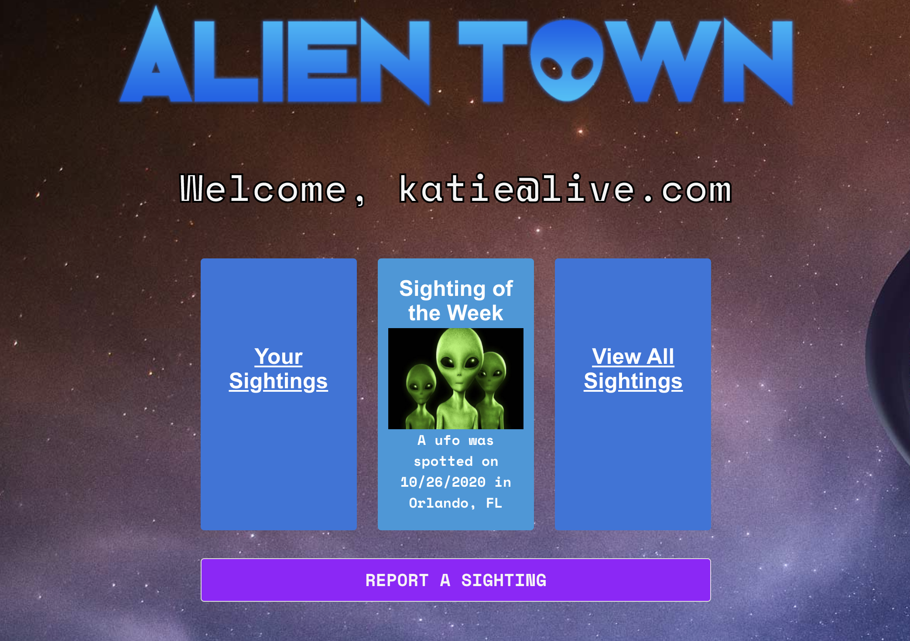
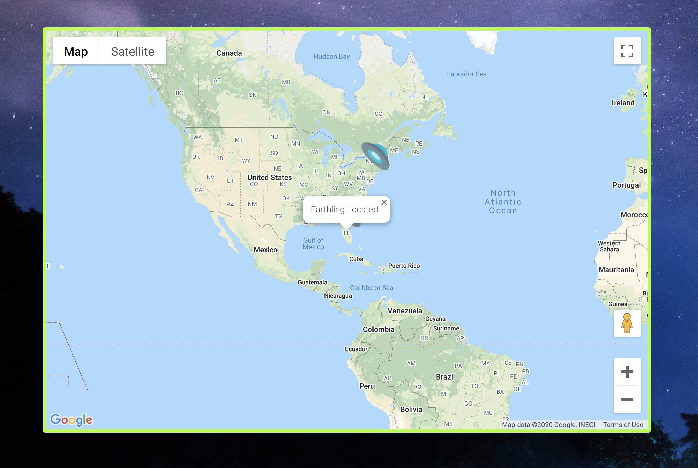
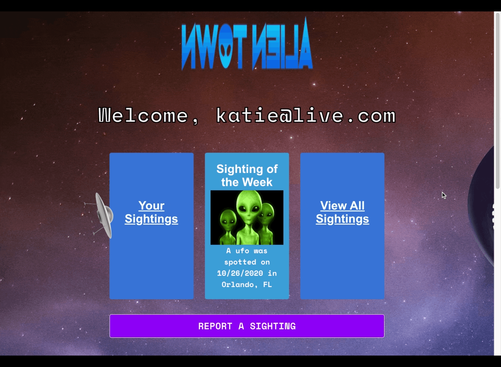

# Alien Town
  

   
#
#### Use the deployed app: http://mega-awesome.herokuapp.com/
# 

## Description 
A web application built for conspiracy theorists and alien lovers alike. This web application provides a space for people all around the globe to report ufo sightings and view others sightings. This app utilizes user authentication to keep information private from those who are not members of the site.

## Table of Contents
- [Installation](#installation)
- [Usage](#usage)
- [Technologies Used](#technology)
- [License](#license)
- [Tests](#tests)
- [Questions](#questions)

## Installation

To install the required packages use the following command

> npm i

## Usage

## Technologies Used
- HTML
- CSS (Bulma Framework)
- Javascript
- Express
- Passport
- Bcrpytjs
- Sequelize
- Google Maps
- Handlebars

## License

MIT

## Tests

There are currently no tests

## Questions

Have any questions? Reach out to a team member: 
- [Crowe828](https://github.com/Crowe828)
- [katiec2116](https://github.com/katiec2116)
- [DrunkOnMystery](https://github.com/DrunkOnMystery)
- [elliotmoffitt](https://github.com/elliotmoffit)

